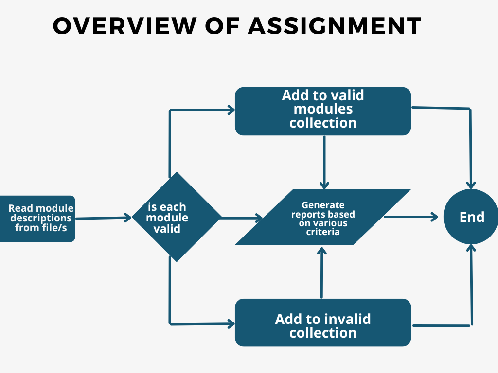
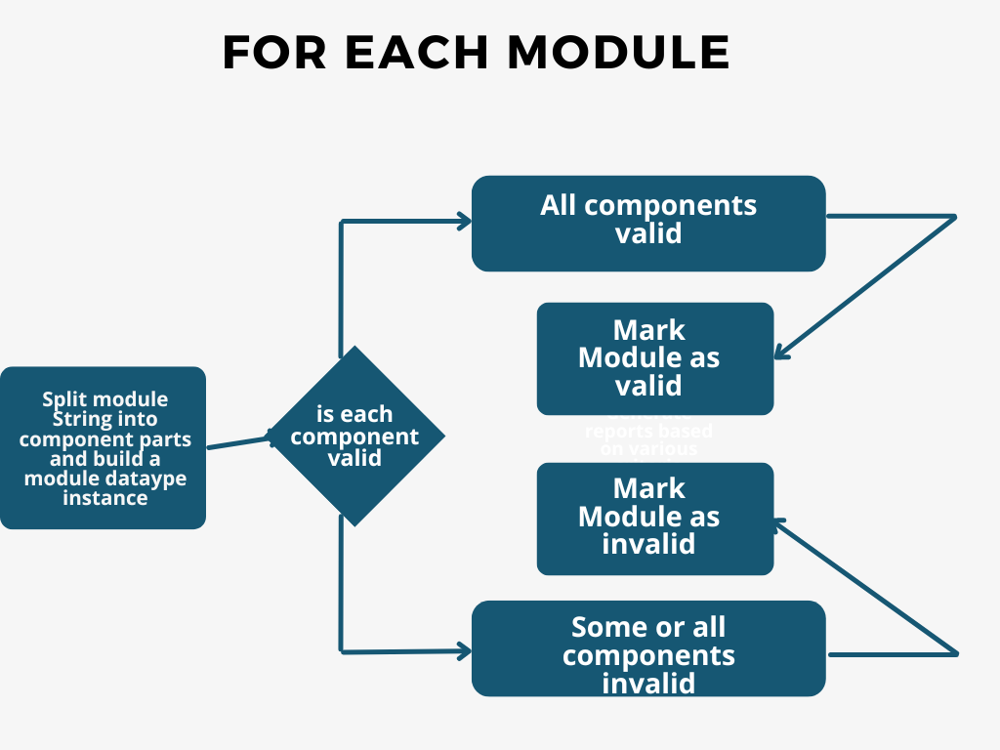

# 1. Module Descriptor Analysis and Formatting - Phase 1

## Overview of full Assignment: 
You will be  tasked with reading in a csv file, which is made up of multiple Module Descriptors. You will  aksed to perform some checks on this data (e.g are all fields populated, valid etc) and write various reports, including
     - formatted verison of these module descriptors 
     - logs of error modules (those that have not passed the validation checks) to documents (e.g. docx, md)

 

## Phase 1 of Assignment
For this phase, you will look at the breaking down of each module into its component parts (fields) and performing validations on each field. 

 

###  Data Set 
The data is in the format of a csv file. It is of the following form (This is a simplified version):

 

You wlil be asked to perform  checks on the data and to generate documents from this data. 

