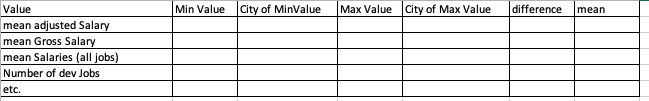

# Data analyis and Reporting 

You are asked to report at least the following using text and html generation :

 

# text only
 - the highest,lowest and mean adjusted salary, difference between highest and lowest mean adjusted salary. In the case of lowest and highest, the city(city name) should be listed
   - repeat this for each of the appropriate number fields

- some extra analysis of your own choosing

# html   
- writing the above data and a formatted version of the salaries file to a html file (as per Stockquotes)

# parameters

- using command line arguments to choose which functionalities to run 

# Extras
- Extra (e.g charts of data (e.g. candlestick data)) 

