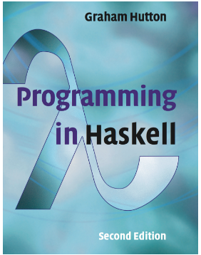
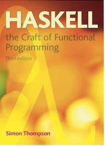
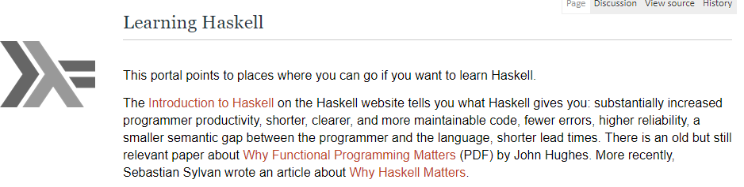

## Useful links

Links to Haskell resources - books, websites etc. 
	

 - The textbook for this course is 'Programming in Haskell', Graham Hutton,Second Edition, Cambridge University Press, ISBN 978-1316626221. Lecture notes will be based on the structure of this book. 

  
 
  A playlist of videos that Graham has produced is available here :
[Programming in Haskell - the videos](https://youtube.com/playlist?list=PLF1Z-APd9zK7usPMx3LGMZEHrECUGodd3)

 ##Other Texts 

 -  Learn you a Haskell For Great Good. This is a free text available to download. 
 
 
 - 'Haskell: the Craft of Functional Programming', Simon Thompson, Third Edition, Pearson, ISBN  0201882957.
 

## Other Resources 

 
 - This  brings you to a treasure trove of ways to learn Haskell including
    - Training Courses
    - Texts books (some free)
    - Online tutorials (look at [meta-tutorial](https://wiki.haskell.org/Meta-tutorial)  in this section to get started) Some are well structured, some look clunky but have  well structured material. Have a look. 
    - Sections on particluar areas e.g. debugging, monads, type classes, generic programming, popular libraries.

   
 - There is a good online community and a very good free email newsletter called [Haskell Weekly](https://haskellweekly.news/). You can sign up and it will be delivered, um, weekly. 
 
 - A Podcast,  called [The Haskell Intelude](https://podcasts.apple.com/ie/podcast/the-haskell-interlude/id1581807590). They usually have interviews with significant people in the Haskell world. 
 

 - There are many online courses. The variety and quality varies. They might be useful if you wish to delve in later at a more advanced level. 
