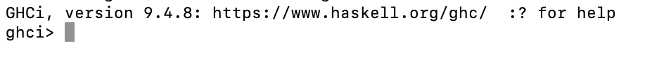

# Installing GHC (Glasgow Haskell Compiler)

- I am assuming that you are installing GHC on your own laptop.

## Downloading and installing GHC

- GHC inludes a compiler and an interpreter (GHCi). 

- There is a good description of how to set up the environment [here]( https://www.haskell.org/get-started//)

- Use GHCup - it makes the installation straightforward. 

 - Install the package. The installation will depend on your OS. Follow instructions as per your OS and we can deal with any issues in the lab.  You don't need to install Stack yet. 
  
 - When you have sucessfully installed GHC, run the interactive environment (GHCi) by simply 
typing ghci at terminal prompt: 

 

You should be seeing version  9.4.8 or higher. 

