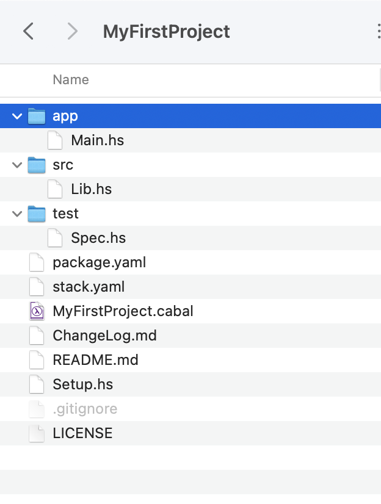
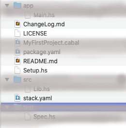
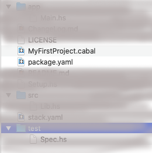
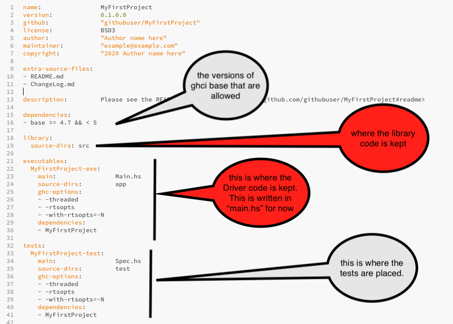

#We examine the default project

The structure that was produced by 

~~~
$stack new MyFirstProject 
~~~

is as follows : 

- Look at the sub folders :
  - *app*   This will contain the Main module or the Driver of the project. This should be used to call the functions as imported or written in /src. Syntactically, we need to ensure that the library functions are properly linked to from here. 
  - *src*   This is where the library of functions are written or held. We will see how these are structured. We either have flat files (e.g. like Lib.hs here) or a curated sub-directory of related code (e.g. Sort)
  - *test*  This is where tests are held. All you know about testing could be written for this. We will not cover this here but as you can imagine, this is very useful and vital part of a project. In this default setup, the Spec.hs simply returns 
  
  ~~~
  Test suite not yet implemented 
  ~~~
  but you can see what structure we need for testing. 

 - Now, look at the files seen below: 

   - *ChangeLog.md* - This is used to log changes you make to the project
   - *LICENSE* - this is a template file for you to fill in with licensing information for your project.
   - *README.md*  - with the usual meaning. This should give a descrption of the project. 
   - *stack.yaml* - this is used but we don't need to change it during development. 

- Next we look at two files that we need to understand. 
  
   - *MyFirstProject.cabal* is the main file that is used by the stack build. It informs the builder what dependencies to use (e.g. versions of libraries, where the code for functions used in \app etc.). However, it is quite complicated. So, in order to ease the burden of writing this, we use the next file (*package.yaml*) to specify the dependencies, then use *hpack* to create the new (or updated) *MyFirstProject.cabal* .
   - *package.yaml*. We will put in the dependencies here. The default file, created by *stack new* has some comments which I have deleted and it looks like :

 

 You can see from this where everything goes. We only need to look at this file, not *MyFirstProject.cabal*. The structures are similar, but by being comfortable with the structure of the (simplified) *package.yaml*, and using *hpack*, we (re) generate the *MyFirstProject.cabal* whenever we have updated the *package.yaml*.

  **Note** As an alternative to using **hpack** at all, you can use **stack build** which includes the regeneration  of the  .cabal file from the updated *package.yaml* file. 