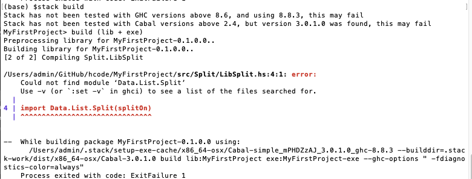

#Example using MyFirstProject - part two - writing code in library and rebuilding the project

##Adding dependencies

Next, we wish to add a function to our LibSplit.hs. The code is: 

~~~
module Split.LibSplit where
	
import Data.Char(toUpper)    
import Data.List.Split(splitOn)    -- this needs to go into dependencies.

ourSplit :: String -> [String]
ourSplit xs = splitOn "A" (map toUpper xs)
~~~

Now, having saved the file,  we try to build again:

~~~
$stack build
~~~

This will give you an error: 

This is because of one of the new lines in *LibSplit.hs*

~~~
import Data.List.Split(splitOn)    -- this needs to go into dependencies.
~~~

Split is an example of a library that needs to be explicitly locally installed. So we need to tell *package.yaml*

We need to add a 

~~~
dependencies:
    - split
~~~
to the library section
(So now the library section looks like)

~~~
library:
  source-dirs: src
  exposed-modules: 
    - Lib  
    - Split.LibSplit
  other-modules: []
  dependencies:
    - split
~~~ 

Now,

~~~
$stack build
~~~

it should work. Then run 

~~~
$stack install 
.. and
$MyFirstProject-exe
~~~

Note that we haven't called the *LibSplit* code so there's no change in what's returned. 

