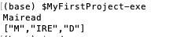

#Example using MyFirstProject - part three - updating app code to call the new library code

 - We wish to change the code of the 'Driver' (in /app/Main.hs)

We will use the *ourSplit* function from LibSplit, so we have 

~~~
-- /app/Main.hs
module Main where

import Split.LibSplit

main :: IO ()
main = do
    input <- getLine
    let result = ourSplit input
    print result
~~~

Note the import statement.

Now, run 

~~~
$stack build
$stack install
$MyFirstProject-exe
~~~

A sample run : 

Also, note that you can use the following:

~~~
$stack ghci
~~~

and then  you can test parts of the full package. Eperiment with this. 