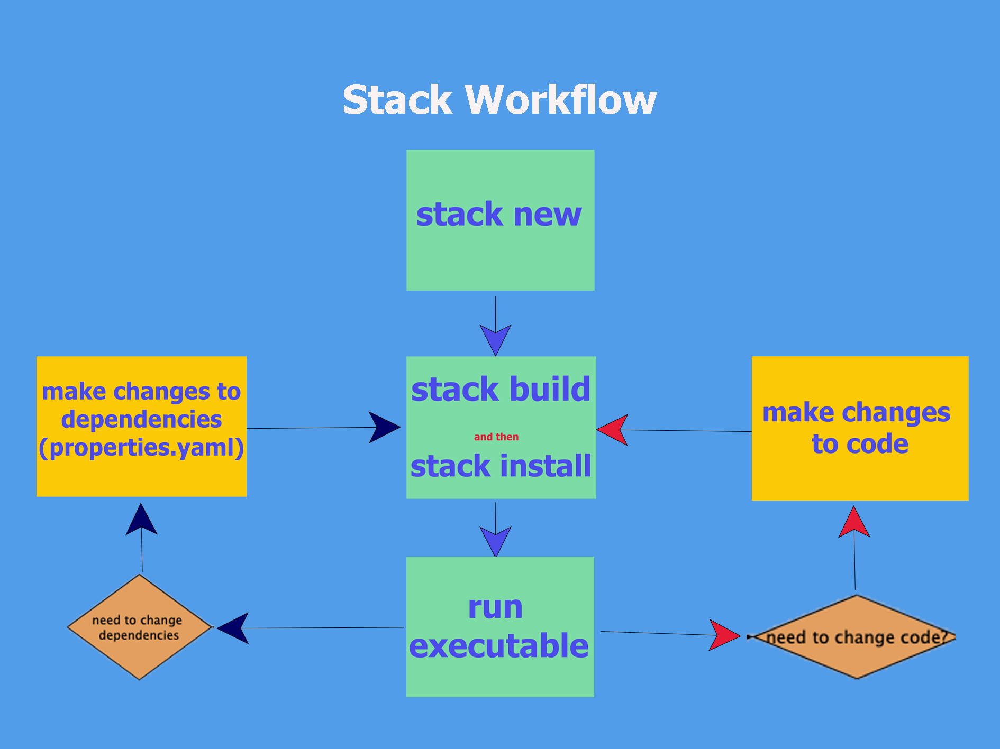
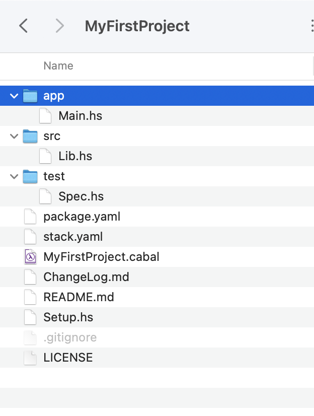
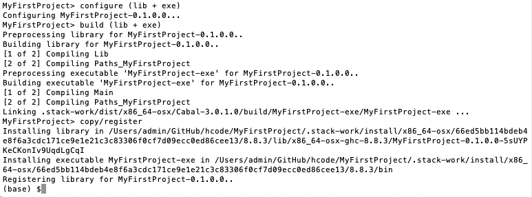
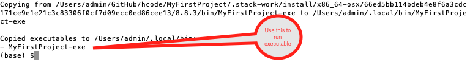
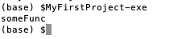

# Creating a Stack Project
The following is a diagram of the workflow for Stack: 

 
To create a stack project, open a terminal in the directory that you want to use for Stack projects. 

- Create Stack project default structure
~~~
$ stack new MyFirstProject
~~~

This should create the following file system : 

Have a look at what is in each of the files and folders: 

- Build Stack project 
~~~
$ cd MyFirstProject -- directory which you have created using new

$ stack build       -- downloads any software (e.g. ghci) in sandbox
~~~

This builds the project. It will give you a message such as : 

- Install Stack project 
~~~
$ stack install 
~~~

This effectively makes the executable version of the project available system-wide. In this case, it will tell you what command to use. 

From this you can see that its main function is to make the executable available system-wide. 

- Run executable version of the Project

~~~
$ MyFirstProject-exe
~~~
This will give you the following: 

In the next section, we will see why this (default) project produced this output. 