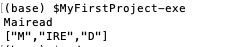

# Example using MyFirstProject - part three - updating app code to call the new library code

 - We wish to change the code of the 'Driver' (in /app/Main.hs)

We will use the *ourSplit* function from LibSplit, so we have 

~~~
-- /app/Main.hs
module Main where

import Split.LibSplit

main :: IO ()
main = do
    input <- getLine   -- this takes input from keyboard and puts it into the input variable
    let result = ourSplit input
    print result
~~~

Note the import statement.

Now, run 

~~~
$stack build
$stack install
$MyFirstProject-exe
~~~

A sample run : 

Also, note that you can use the following:

~~~
$stack ghci
~~~

and then  you can test parts of the full package. Experiment with this. 

***Note***
~~~
 input <- getLine   -- this takes input from keyboard 
                    -- and puts it into the input variable
~~~

This ***<-*** symbol is used for IO interactions only, i.e. taking input from the outside world (e.g. keyboard) and putting the input value into the variable on the Left Hand Side of the expression. 