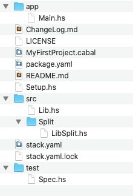

# Structuring code in a Stack project

Look at the final version of the MyFirstProject project that we constructed in the previous lab. 

- the *app* directory
  - will contain the Driver code. This Driver code should be seen as calling the functions from the libraries (external or internal) with minimal programming logic

- the *src* directory
  - will contain the main bulk of code. 
  - The code can be structured into subdirectories (per theme, e.g. Sorting, Data Analysis, Parsing etc.) 

- the *test* directory
  - For usual testing purposes.

Note you should structure your future stack projects using this structure

