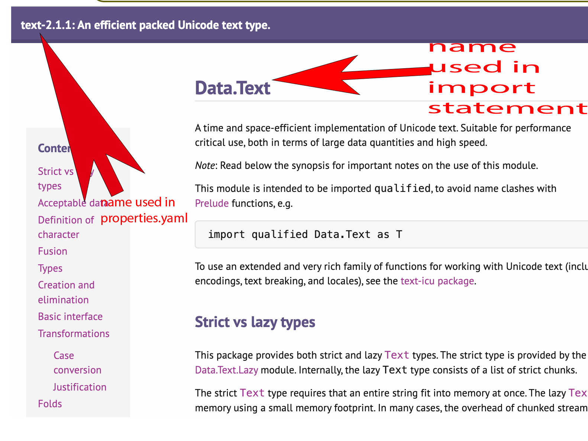

# Exercises

## Exercise 1
- Create a new Stack Project (call it pal-checker)
- Build, install and run the default project. 
- Change the project to implement the following: 
   - In your library (/src),  create a file called  Palindrome.hs
   - Write a function isPalindrome which takes in a String and returns ***true*** if the String is a palindrome and ***false*** otherwise. (A palindrome is a String that reads the same forwards as backwards)
   - make the other changes you need in package.yaml:

     - Add 
         ~~~
       exposed-modules: Palindrome
       ~~~
        
        to the ***library*** section
       
     - Add 
       ~~~
           dependencies:
              -   pal-checker
        ~~~
        to the ***executables*** section

   - Call this function in the /app/Main.hs. Read in a string from the keyboard and print out "It is a palindrome" if it is and "It is not a palindrome" otherwise, e.g. "navan", "oxo" are palindromes, "apple", "orange" are not palindromes. 

(**Hint:** if a string is a palindrome then the string is exactly equal to the reverse of the string. For this exercise, you may ignore case, so, "navan" is a palindrome, but "nAvan" is not.)
  

## Exercise 2
- Create a new Stack Project (call it text-pal-checker)
- Build, install and run the default project. 
- This project should implement the functionality of Exercise 1 (i.e. checking for a palindrome), but this time with the use of the Data.Text package (details on hackage [here](https://hackage.haskell.org/package/text-2.1.1/docs/Data-Text.html)). 
- To do this use need to have **text** included as a dependency in package.yaml.
- Data.Text provides functions with similar names and functionality as Prelude functions on Strings but is used in production Haskell as it is more efficient. 
- Because Data.Text uses Prelude names you should:
    - Use `import Data.Text as T` in the import section
    - preface the Data.Text functions with `T` to specify the use of the Data.Text version of the functions. 
  
- Improve the functionality of the palindrome checker by: 
    - allowing mixed case , e.g. "nAvaN" is now a palindrome
    - strip all spaces so that e.g. "na    va  n" is now a palindrome
    - strip all punctuation marks (e.g. '!', '?', '.') so that "navan!" is now a palindrome.          
  
 - You will need the following imports: 
    - `import Data.Char ( isSpace, isPunctuation )`
    - `import Data.Text as T ( filter, pack, reverse, toLower )` 
  
You will find the following (imported) functions useful:

 - From Data.Char:
      - `isSpace` returns True if a char is a space.
      - `isPunctuation` returns True is a char is a punctuation mark.

 - From Data.Text:
      - `filter` (which you should call as `T.filter`) has the usual meaning.
      - `pack` this converts a String value to a corresponding Text value.
      - `toLower` (which you should call as `T.toLower`) takes a Text value and returns that value, all in lower case. 

Note : 

When you look for information on a package (e.g. Data.Text), look for Data.Text, you will see a package name in the top left hand corner. This (lowercase) name is what is used in package.yaml. For our purposes, we do not need the version numbers, just the package name (i.e. text)

The Data.Text is what is used in the ***import*** statement. 